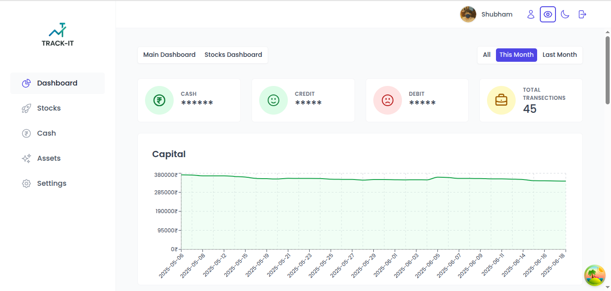
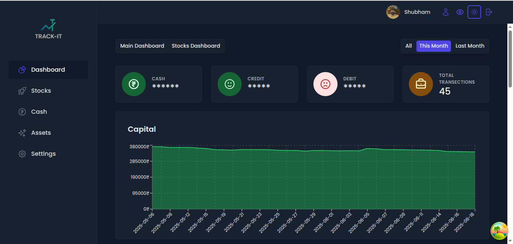
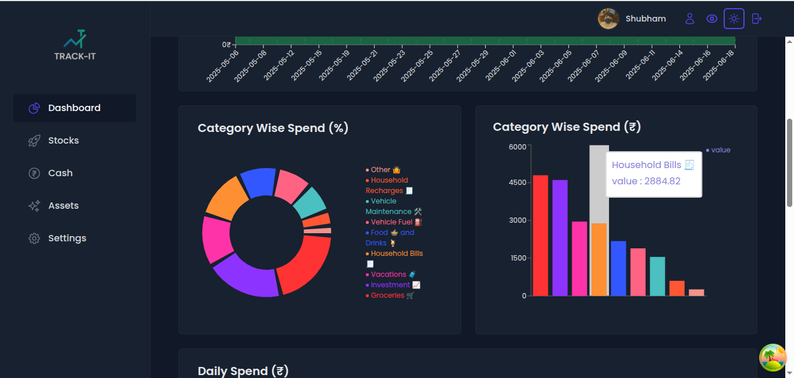
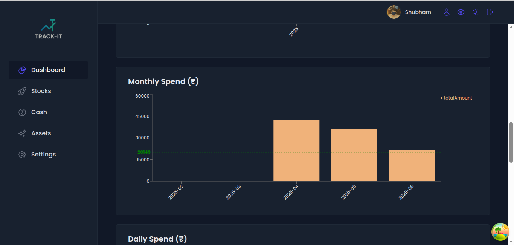
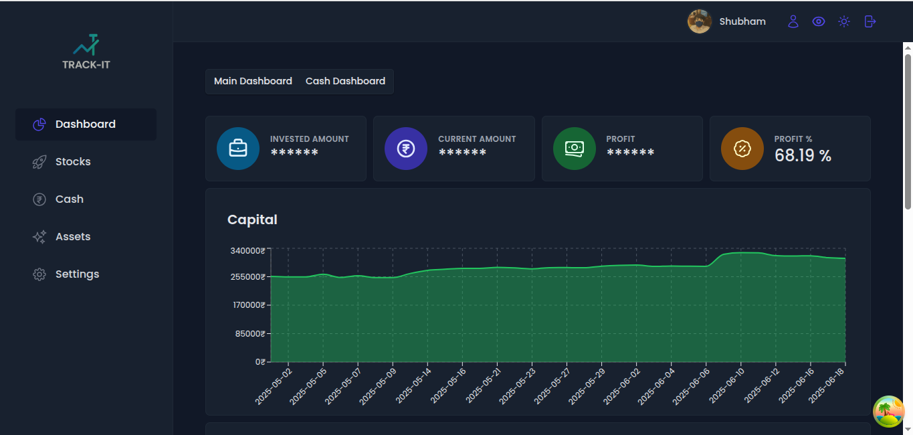
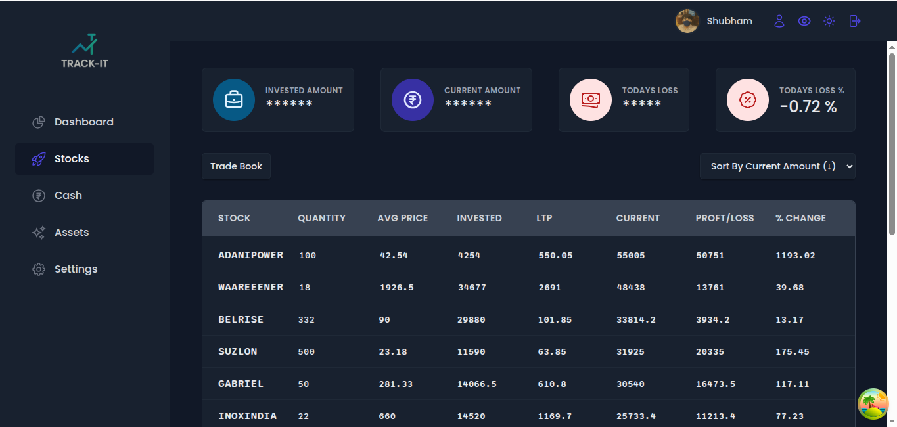

Portfolio Mangaging app with beautiful dashboard and ton of data about the stocks , cash and assets you have.


To install dependencies:

```bash
bun install
```

To start a development server:

```bash
bun dev
```

To run for production:

```bash
bun start
```

This project was created using `bun init` in bun v1.2.11. [Bun](https://bun.sh) is a fast all-in-one JavaScript runtime.

Screen Shots :- 
## Preview













